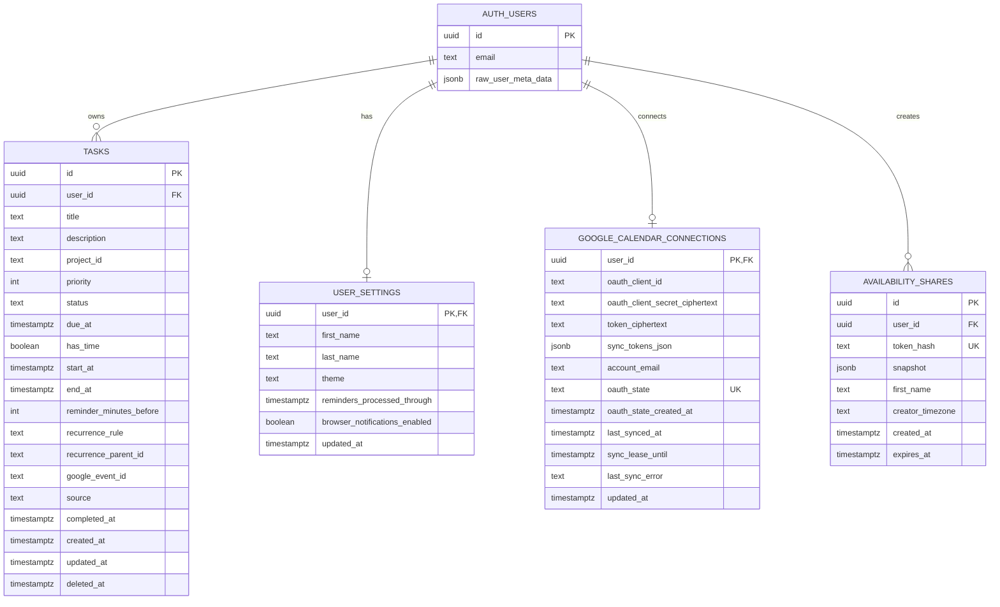
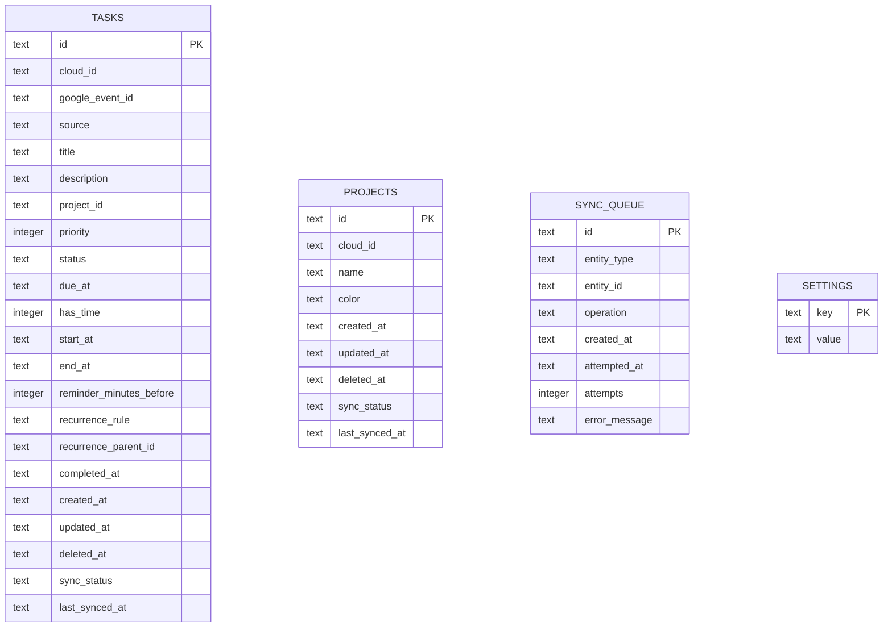
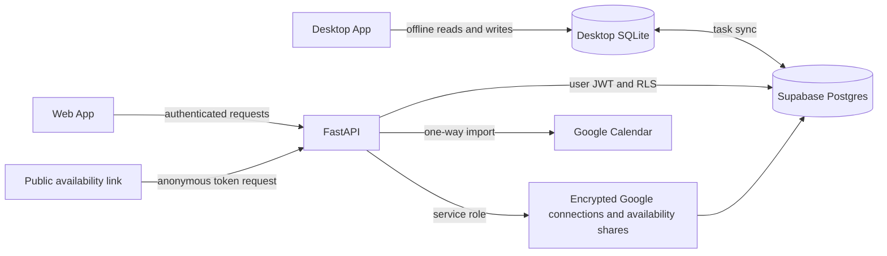

# Sway Database Map

Sway currently uses two databases:

- **Supabase Postgres** is the cloud database used by the web app, API, and desktop sync.
- **Desktop SQLite** is the desktop app's offline-first local database and sync cache.

## Supabase Postgres

### Supabase Table Purposes

| Table | Purpose | Access |
|---|---|---|
| `auth.users` | Supabase-managed accounts and authentication data. | Managed by Supabase Auth. |
| `public.tasks` | Cloud copy of Sway and imported Google Calendar tasks. | Users can access only their own rows through RLS. |
| `public.user_settings` | Per-user profile names and web settings such as theme and notification state. | Users can access only their own row through RLS. |
| `public.google_calendar_connections` | Encrypted per-user Google OAuth credentials/tokens and calendar sync state. | API service-role access only; no public RLS policies. |
| `public.availability_shares` | Frozen public availability snapshots that expire after seven days. | API service-role access only; no public RLS policies. |

All public tables referencing `auth.users` use `ON DELETE CASCADE`, so deleting an account
also deletes its cloud tasks, settings, Google connection, and availability shares.

First and last names live on `public.user_settings`; a separate profiles table is not currently needed.
New availability shares freeze only the creator's first name for their public heading.

## Desktop SQLite

### SQLite Table Purposes

| Table | Purpose |
|---|---|
| `tasks` | Offline-first task cache with cloud sync metadata. |
| `projects` | Local project records. A matching Supabase projects table does not currently exist. |
| `sync_queue` | Pending or failed desktop-to-cloud synchronization operations. |
| `settings` | Local desktop key/value settings, including desktop-only configuration. |

SQLite does not currently declare foreign-key constraints between these tables. Fields such as
`tasks.project_id` and `sync_queue.entity_id` are application-managed references.

## Main Data Flows

The schema sources of truth are:

- Cloud: [`supabase/schema.sql`](supabase/schema.sql)
- Desktop local: [`apps/desktop/app/db/schema.sql`](apps/desktop/app/db/schema.sql)
